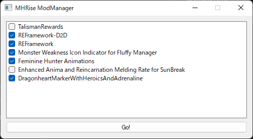

# whats this?
this is mod manager for MonsterHunterRise(maybe, capcom games are all okay) 

# why doesnt use Fluffy Manager 5000?

if you can use it, its better. 
i just wannted make it.

# how to?

1. if you use the tool in the first time, when it shows DirectoryBrowse dialog 
   please select MHRise install path directory
2. please choise mods you wanna install
3. Push Go! and Launch Game! have fun :)

# require module
* PyQt5

# feature

* upgrade automatically mods
* show mods list
